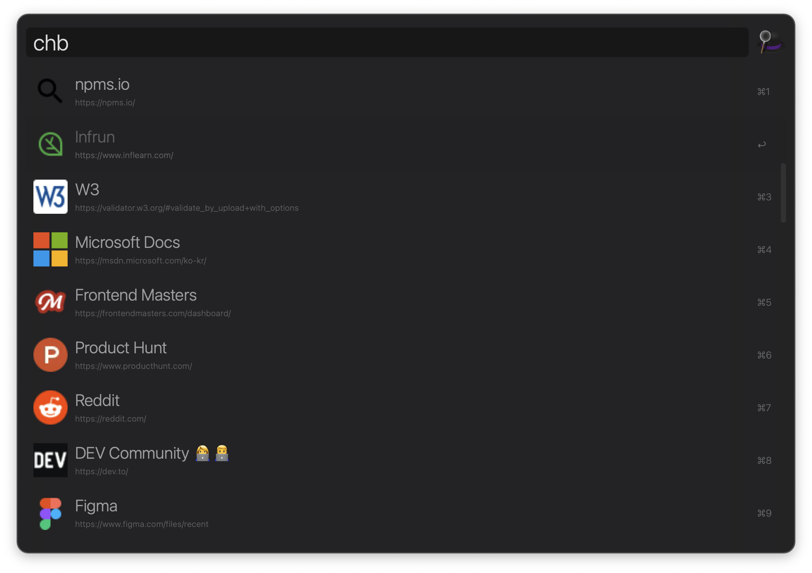
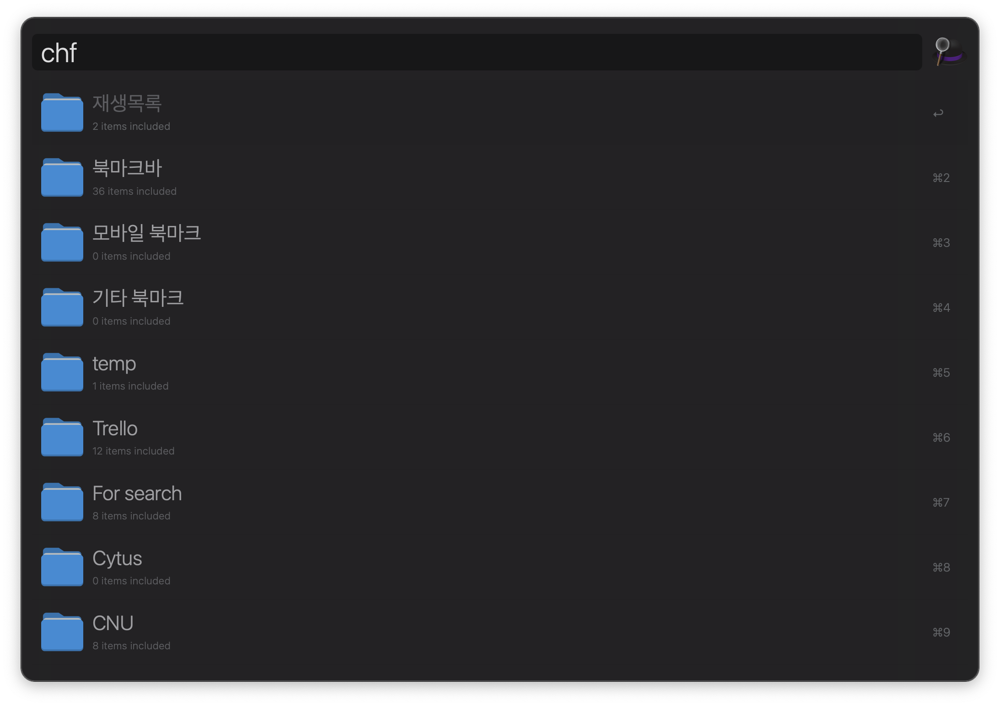
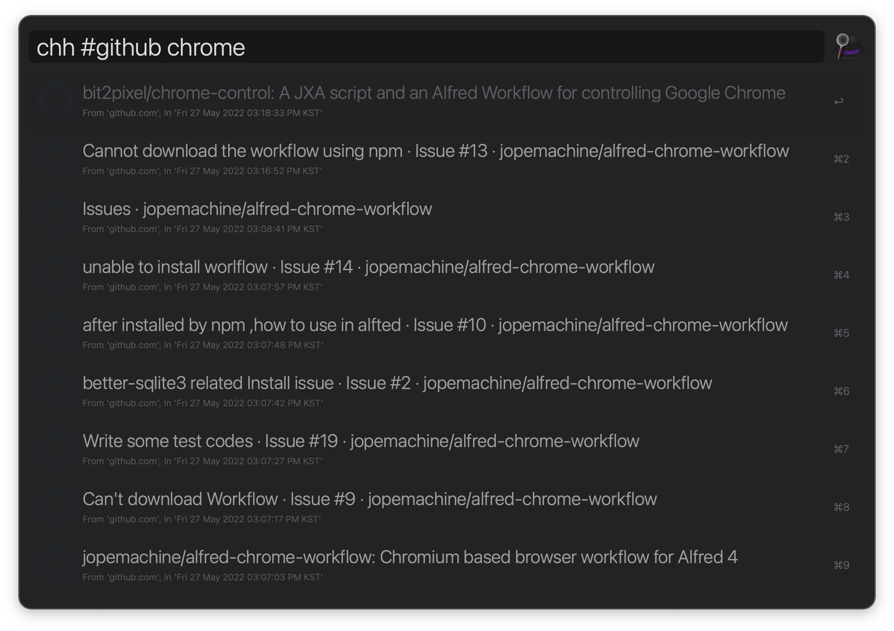
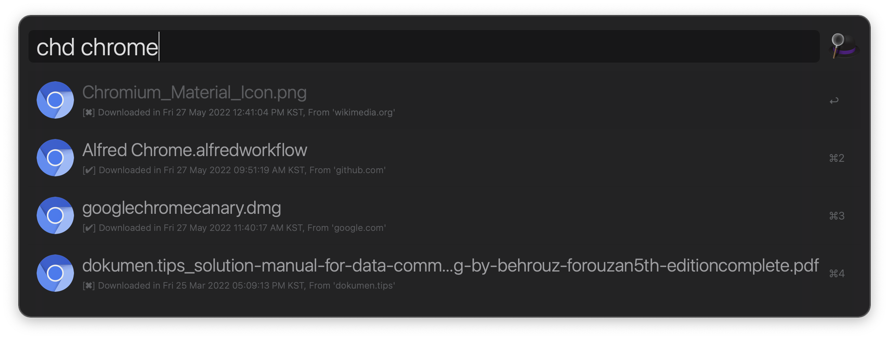
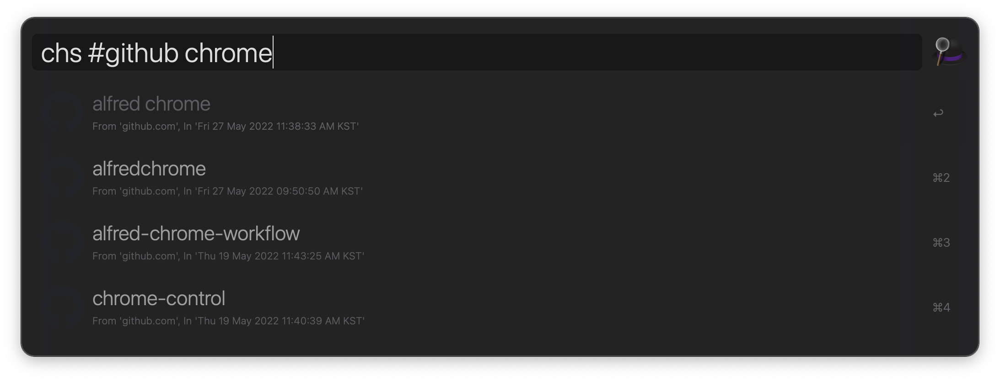
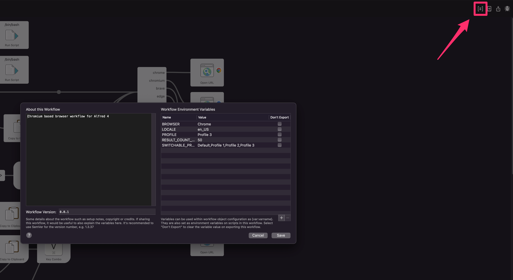

<h1 align="center">
		Alfred-chromium-workflow 
		
		
		
</h1>

Alfred workflow for Chromium browsers

## Why?

This workflow originated from [alfred-chrome-workflow](https://github.com/jopemachine/alfred-chrome-workflow).

The previous workflow has several [installation issues like this](https://github.com/jopemachine/alfred-chrome-workflow/issues/13#issuecomment-1103938917).

In addition to resolving installation issues, this workflow provides several following benefits over the previous one.

* Support favicon images in almost all features
* Support switching browsers, profiles with ease
* Support more Chromium based browsers
* Lightning-fast
* Provide localized subtitle

## 🌈 Features

* 📄 *Search visit histories*
* 🔖 *Search bookmark, bookmark folders*
* 📜 *Search search histories*
* 🔎 *Search download logs*
* 📒 *Search and copy your autofill data*
* 📎 *Search your opened tabs and focus, close them*

## 📌 Prerequisite

The prerequisites below are required to use that package.

* [Alfred Powerpack](https://www.alfredapp.com/powerpack/)

## 🎯 Supported Browsers

Currently supported browsers are as follows.

- [x] Chrome
- [x] Chrome Beta
- [x] Chrome Canary
- [x] Chromium
- [x] Edge
- [x] Edge Canary
- [x] Brave
- [x] Naver Whale
- [x] Epic
- [x] Vivaldi
- [x] Opera

This workflow assumes your browser is `Chrome` at default.

You can switch the browser with `ch browser`.

## 🔨 How to install

Download and double click the `.alfredworkflow` file on the [Release page](https://github.com/jopemachine/alfred-chromium-workflow/releases).

Note that if your browser is not the default browser (`Chrome`), you need to switch your browser through `ch browser` first.

Register your customized hotkeys if you need to.

## 📗 Usage

### chb

Retrieve bookmarks.

### chf

Retrieve bookmark folders.

### chh

Retrieve visit histories.

Append word starting with `#` to retrieve only the logs in that domain.
 
Example:

`chh #github [foo bar]`

### chd

Retrieve download histories.

### chdc

Retrieve download histories but only show existing files.

### chs

Retrieve your search histories.

Append word starting with `#` to retrieve only the logs in that domain.

Example:

`chs #github [foo bar]`

### cha

Retrieve autofill data.

Press enter with option key to paste the value directly.

### chid

Retrieve login data (like email).

Press enter with option key to paste the value directly.

### cho

Open new window through selected profile.

If you change your profile through `ch profile`, other commands try to work with the previously opened window.

This command would be useful in such a case.

Open new window with changed profile before the command.

### cht

Search opened tabs and focus, close them.

Tabs are sorted by their domain.

### ch browser

Switch browsers with ease.

This command also let you change the browser profile after changing the browser.

### ch profile

Switch profiles with ease.

Tip: You can check what is your Browser's profile's name in `chrome://version`.

### ch helper

Provides several useful helper features.

* Update workflow if a new version is available
* Cache favicon manually
* Open Github issues
* Open Alfred forum link
* Open READMD.md

## 🔖 Options

Configure below options through `Workflow Environment Variables`.

### Profile

Browser's profile name.

You don't need to change this value manually.

Instead, you can change this value through `ch profile` with ease.

### CustomizedProfiles

List up your custom profile names if there are.

This could be useful when you have profiles in customized locations.

You can switch your profile through `ch profile` with `Profile {number}`, `Default` and these values.

Each profile name should be splited with comma (`,`).

### Locale

This is used to provide localized subtitles.

Refer to the following page for seeing supported locales.

https://github.com/klauspost/lctime/tree/master/internal/locales

### Browser

Browser name.

You don't need to change this value manually.

Instead, you can change this value through `ch browser` with ease.

### ResultCountLimit

Max number of items to show in Alfred.

But the maximum count limit is limited to `200` regardless of its value to prevent truncating json string.

## 🌟 Contribution

Contributions of any kind are welcome.

### Add supporting new browser

This workflow needs help to support as many browsers as possible.

To add new browser, please follow below guideline.

1. Check the browser is based on `Chromium`.
2. Add new path to `GetProfileRootPath` in `src/utils.go`.
3. Add the browser's proper Application Name to `getApplicationName` in `src/tabManager.go`. You can check this value through Applescript Editor's Dictionary.
4. Add proper `Open URL` block of `info.plist` using Alfred.
5. Add new browser's item `SelectBrowser` in `src/config.go`.
6. Add the browser name to `READMD.md`.
7. Add the browser's icon to `assets/browser-icons`.

## Related

You may also consider below workflows interesting.

- [alfred-firefox](https://github.com/deanishe/alfred-firefox/): Search and control Firefox from Alfred
- [chrome-control](https://github.com/bit2pixel/chrome-control): A JXA script and an Alfred Workflow for controlling Google Chrome

## License

MIT © [jopemachine](https://github.com/jopemachine/alfred-chromium-workflow)
